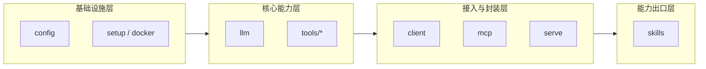

# ChatTool 架构概览与设计特点

本文档用于系统说明 ChatTool 当前架构的组织方式、设计原则和适用价值。目标不是只描述目录，而是解释这套结构为什么这样设计，以及它如何支持后续持续扩展。

## 设计目标

ChatTool 不是单一功能库，而是一套围绕 `CLI`、工具能力、服务化能力和 Agent 技能持续生长的开发体系。它的核心目标有四个：

- 让能力先可执行，再可复用。
- 让实现层、接入层和场景层保持清晰分工。
- 让一次任务沉淀为长期能力，而不是一次性脚本。
- 让本地执行、远程服务和 Agent 调用共享同一套底层能力。

## 总体架构

当前仓库中的实际对应关系如下：

- `src/chattool/config/`：环境变量、默认值和 profile 管理。
- `src/chattool/llm/`：模型路由、Chat 对象、响应封装。
- `src/chattool/tools/`：DNS、Lark、Image、Network、GitHub、Browser、Zulip、CC 等核心工具。
- `src/chattool/client/`：统一 `chattool` CLI 入口与命令路由。
- `src/chattool/mcp/`：MCP 服务入口和工具注册。
- `src/chattool/serve/`：服务端能力承载，处理密钥敏感或算力敏感场景。
- `src/chattool/setup/` 与 `src/chattool/docker/`：环境准备与容器化支持。
- `src/chattool/skills/`：面向 Agent 的技能安装和组织。

## 核心设计原则

### 1. CLI 优先，代码为根

ChatTool 的主要使用方式不是直接调用内部模块，而是通过 `chattool`、`chatenv`、`chatskill` 等 CLI 命令来执行能力。

这样设计有几个直接好处：

- 对人工用户更友好，终端可直接调用、调试和组合。
- 对自动化更友好，Shell、CI、脚本都能稳定接入。
- 对测试更友好，真实链路可以直接围绕 CLI 做验证。
- 对 Agent 更友好，CLI 是最容易审计和复现的执行接口。

仓库里这点体现得很明确：

- [src/chattool/client/main.py](../../src/chattool/client/main.py) 统一聚合 `env`、`dns`、`serve`、`network`、`mcp`、`lark`、`image`、`gh`、`browser`、`zulip`、`skill`、`setup`、`cc`、`docker` 等子命令。
- [pyproject.toml](../../pyproject.toml) 直接暴露 `chattool`、`chatenv`、`chatskill` 三类入口。
- `cli-tests/` 与 `mock-cli-tests/` 都采用 doc-first 机制，说明 CLI 被视为一等公民，而不是实现之后顺带补一个壳。

这意味着 ChatTool 的典型路径是：

`代码实现 -> CLI 固化 -> 文档测试 -> 服务化或技能化`

而不是：

`先做一个临时脚本 -> 用完即弃`

### 2. 核心能力集中到 `tools/`，避免入口层漂移

ChatTool 强调“能力实现”和“能力接入”分离。

- `tools/` 是工具能力唯一归属层。
- `client/` 只负责 CLI 接入与命令编排。
- `mcp/` 只负责协议适配和工具注册。
- `serve/` 只负责服务化承载。
- `skills/` 只负责场景化组合和能力出口。

这种边界在 [docs/development-guide/directory-responsibilities.md](directory-responsibilities.md) 里已经被明确写成规则。它的优势是：

- 新能力知道应该先落在哪里，不会同时出现在多个入口层。
- 业务逻辑不会散落在 CLI、MCP、服务端多个位置，降低维护成本。
- 同一个能力可以被多种出口复用，不需要复制实现。

例如 DNS 能力同时支撑：

- `chattool dns ...`
- `chattool dns cert-update ...`
- `tools/dns/mcp.py` 中的 MCP 工具接入
- 可能进一步被 skills 编排为任务流程

### 3. 基础设施前置，把环境问题单独治理

很多工具项目的问题不在业务逻辑，而在环境、依赖、密钥、浏览器、系统服务这些外围条件。ChatTool 通过 `config/`、`setup/`、`docker/` 把这些问题前置处理。

- `config/` 统一环境变量读取、默认值和 profile 管理。
- `setup/` 负责 Codex、Claude、Chrome、FRP、Node.js 等环境准备。
- `docker/` 负责模板化部署和容器环境组织。

这样做的优势是：

- 运行条件可审计、可复现。
- 新工具开发不必每次重新处理环境初始化。
- CLI 可以直接继承统一的配置读取和交互规范。

这也是为什么 ChatTool 不只是工具箱，而更像一个“工具运行平台”。

### 4. 本地、云端、Agent 三种出口共享同一能力底座

ChatTool 不是只为本地命令行设计。它同时支持三类出口：

- 本地 CLI：给人和脚本直接使用。
- 远程服务：把重依赖、重算力、敏感密钥相关能力放到服务端。
- Agent 技能：把现有能力重新编排成可复用的场景化 skill。

这种设计的价值在于：

- 本地执行轻量，适合开发和人工操作。
- 服务端承载复杂逻辑，便于密钥隔离和集中维护。
- Agent 可以基于稳定能力构建更高层工作流，而不是每次重新实现工具细节。

例如：

- `src/chattool/serve/lark_serve.py` 适合处理机器人服务场景。
- `src/chattool/mcp/` 和 `tools/*/mcp.py` 适合把现有工具暴露给支持 MCP 的客户端。
- `src/chattool/skills/cli.py` 支持把技能安装到 Codex / Claude Code。

### 5. 任务驱动沉淀，而不是功能堆砌

ChatTool 当前架构很重要的一点，是它不是先抽象一套理想架构再找场景去填，而是从真实任务出发，把完成任务的路径逐步沉淀成长期资产。

这条路线在 [skills/practice-make-perfact/SKILL.zh.md](../../skills/practice-make-perfact/SKILL.zh.md) 和 [docs/development-guide/task-driven-iteration.md](task-driven-iteration.md) 中都已经明确：

1. 先完成任务。
2. 判断能力是通用还是任务特定。
3. 通用能力收敛到 `src/`。
4. 场景能力收敛到 `skills/`。
5. 同步文档、测试和导航。

这套机制的优势是：

- 项目每完成一个任务，都有机会沉淀为工具、CLI、MCP 或 skill。
- 能力会持续积累，而不是随着任务结束而消失。
- 文档和结构跟着实际工作流一起生长，避免“纸面架构”。

## 各层职责与价值

### `config/`：统一配置入口

代表文件：

- [src/chattool/config/cli.py](../../src/chattool/config/cli.py)

价值：

- 提供 `chatenv` 统一环境管理入口。
- 支持敏感值脱敏展示、多 profile 管理、按类型筛选。
- 避免业务代码直接散落地读取 `os.environ`。

它解决的是“配置如何稳定获取”的问题。

### `llm/`：统一模型能力抽象

代表目录：

- [src/chattool/llm](../../src/chattool/llm)

价值：

- 统一模型路由和 Chat 对象。
- 为工具和服务层提供稳定调用接口。
- 把模型调用从具体场景里剥离出来，降低耦合。

它解决的是“语言模型能力如何成为公共底座”的问题。

### `tools/`：能力主战场

代表目录：

- [src/chattool/tools/dns](../../src/chattool/tools/dns)
- [src/chattool/tools/lark](../../src/chattool/tools/lark)
- [src/chattool/tools/image](../../src/chattool/tools/image)
- [src/chattool/tools/network](../../src/chattool/tools/network)
- [src/chattool/tools/github](../../src/chattool/tools/github)
- [src/chattool/tools/zulip](../../src/chattool/tools/zulip)
- [src/chattool/tools/browser](../../src/chattool/tools/browser)

价值：

- 每个目录聚焦一个可复用能力域。
- 工具实现可以同时面向 Python、CLI、MCP 多种形式开放。
- 新增能力时，优先进入 `tools/<name>/`，保证项目归位规则稳定。

它解决的是“真正的能力应该放在哪里”的问题。

### `client/`：统一 CLI 门面

代表文件：

- [src/chattool/client/main.py](../../src/chattool/client/main.py)

价值：

- 所有命令由一个统一入口聚合，降低学习成本。
- 通过 `LazyGroup` 做懒加载，控制 CLI 启动时间。
- 将“接入逻辑”和“实现逻辑”切开，便于长期扩展。

它解决的是“用户如何找到和调用所有能力”的问题。

### `mcp/`：协议层适配

代表目录：

- [src/chattool/mcp](../../src/chattool/mcp)

价值：

- 把已有工具能力暴露为 MCP Server。
- 让支持 MCP 的客户端可以共享 ChatTool 的能力底座。
- 避免为每个客户端单独造一套重复接口。

它解决的是“工具如何进入标准协议生态”的问题。

### `serve/`：服务端承载复杂能力

代表目录：

- [src/chattool/serve](../../src/chattool/serve)

价值：

- 适合承接浏览器、截图、证书分发、机器人服务等服务端更合适的能力。
- 让本地命令行入口保持轻量。
- 对敏感凭证和复杂依赖形成隔离带。

它解决的是“哪些能力不该全部压在本地执行”的问题。

### `setup/` 与 `docker/`：环境工程化

代表目录：

- [src/chattool/setup](../../src/chattool/setup)
- [src/chattool/docker](../../src/chattool/docker)

价值：

- 把环境安装与部署配置纳入仓库治理，而不是留给使用者手工处理。
- 减少“功能没问题，但环境跑不起来”的摩擦。
- 为后续工具扩张提供稳定底层条件。

它解决的是“项目如何在不同机器和场景落地”的问题。

### `skills/`：面向 Agent 的能力出口

代表目录：

- [src/chattool/skill](../../src/chattool/skill)
- [skills/practice-make-perfact](../../skills/practice-make-perfact)

价值：

- 把已有能力按任务场景重新组织，而不是重复发明实现。
- 让 Agent 直接复用仓库现有工具和流程。
- 将“任务经验”沉淀为“可复制技能”。

它解决的是“如何把底层工具真正变成高层工作流”的问题。

## ChatTool 的主要特点

### 1. 不是单点工具，而是工具平台

ChatTool 同时包含配置管理、工具实现、CLI 出口、服务端出口、MCP 出口和 Agent 技能层。它解决的不是某一个具体命令，而是“如何让能力持续增长并且稳定暴露”。

### 2. 不是只关注实现，而是关注执行链路

仓库里有：

- `src/` 中的正式能力实现
- `cli-tests/` 中围绕真实 CLI 行为的 doc-first 测试设计与执行实现
- `mock-cli-tests/` 中围绕 CLI 编排与 mock 场景的 doc-first 测试设计与执行实现
- `docs/` 中和目录结构直接对应的说明文档

这说明 ChatTool 重视“能力如何被用起来”，而不只是“代码是否能跑”。

### 3. 不是一次性任务，而是持续沉淀系统

`practice-make-perfact` 的核心思想是：

- 先把事情做成。
- 再把过程整理成工具、CLI、技能和规范。

这是 ChatTool 架构最有辨识度的部分之一。它让仓库的增长方式不是横向堆脚本，而是纵向沉淀能力。

### 4. 对扩展和并发开发友好

由于目录边界清晰，新工具和新入口通常可以沿着已有模式扩展：

- 新能力先建 `tools/<name>/`
- 再按需要接入 `client/`
- 若要服务化，则接入 `serve/`
- 若要暴露给 Agent，则补 `skills/`

这种组织方式天然适合多人并行开发，也适合后续规模继续扩大。

## 新能力的推荐落地路径

当 ChatTool 新增一个能力时，建议遵循以下顺序：

1. 先在 `tools/<name>/` 完成核心实现。
2. 为能力提供稳定 CLI 入口，优先保证人工可执行和可调试。
3. 如有跨客户端接入需求，再增加 `mcp.py` 或服务端封装。
4. 若能力对应稳定场景，再沉淀为 `skills/<name>/`。
5. 同步补 `cli-tests/` 或 `mock-cli-tests/`、`docs/`、`mkdocs.yml`；仓库根下 `tests/` 不再作为新功能默认维护面。

这条路径与仓库当前的开发规则一致，也与 `practice-make-perfact` 的任务沉淀思路一致。

## 适用场景

ChatTool 这套架构尤其适合以下场景：

- 经常从真实任务中长出新工具的项目。
- 既需要本地 CLI，又需要远程服务或 Agent 接入的项目。
- 需要统一治理环境、密钥、部署和测试链路的项目。
- 需要把个人工作流逐步沉淀成团队可复用能力的项目。

## 总结

ChatTool 的核心价值，不在于单个工具功能有多少，而在于它建立了一条稳定的能力生长链路：

`真实任务 -> 核心实现 -> CLI 固化 -> 协议/服务接入 -> Skill 场景化 -> 文档与测试沉淀`

这条链路让项目既能快速完成当前任务，也能持续把任务经验转化为长期资产。对一个以 CLI、工具和 Agent 协作为核心的仓库来说，这正是最重要的架构优势。
