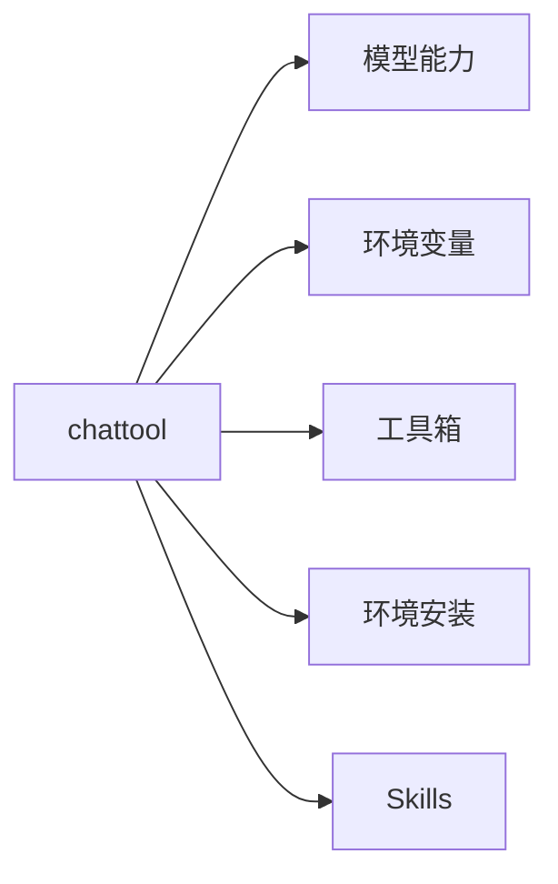
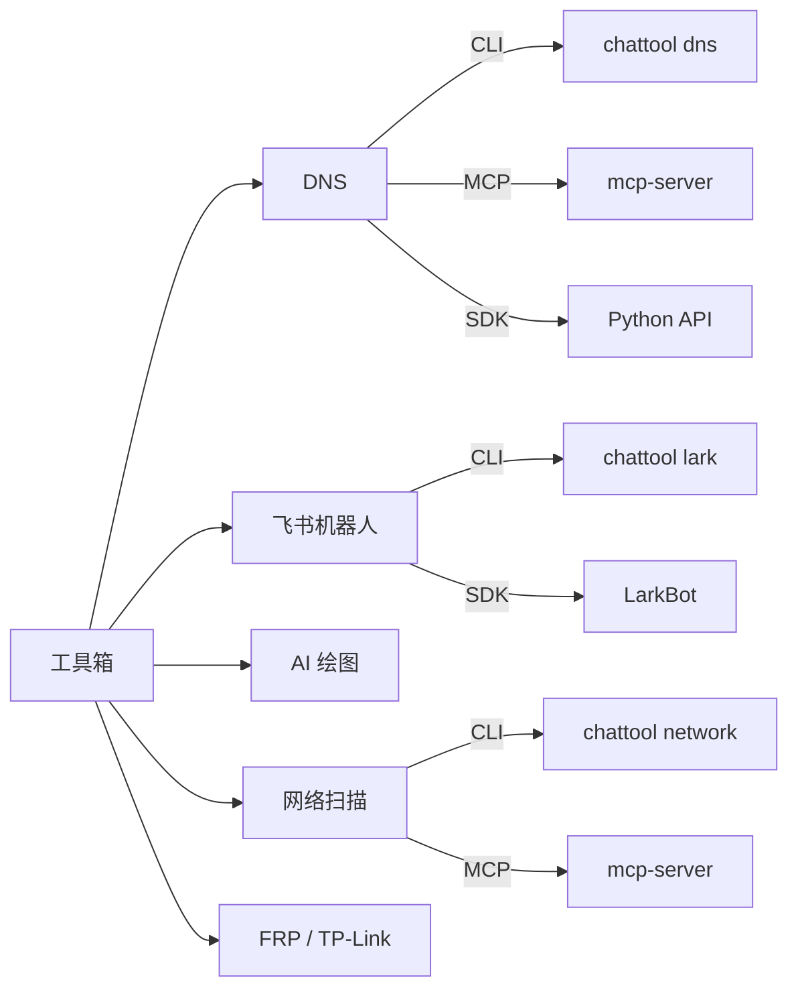

<div align="center">
    <a href="https://pypi.python.org/pypi/chattool">
        
    </a>
    <a href="https://github.com/cubenlp/chattool/actions/workflows/ci.yml">
        
    </a>
    <a href="https://chattool.wzhecnu.cn">
        
    </a>
    <a href="https://codecov.io/gh/cubenlp/chattool">
        
    </a>
</div>

ChatTool 是一个以 CLI 为核心的 Python 开发套件，集成 LLM 对话、工具箱（DNS、飞书、绘图等）、MCP 服务和环境管理。

## 架构概览

**板块结构**



**工具箱接入形式**



## 安装

```bash
pip install chattool --upgrade

# 含图像工具
pip install "chattool[images]"

# 含开发依赖（MCP 等）
pip install "chattool[dev]"
```

## 快速上手

### 环境变量

```bash
chatenv init -i          # 交互式初始化
chatenv cat              # 查看当前配置（敏感值打码）
chatenv set OPENAI_API_KEY=sk-xxx
```

### LLM 对话

```python
from chattool import Chat

chat = Chat("你好")
resp = chat.get_response()
print(resp.content)
```

### 飞书机器人

```bash
chattool lark send USER_ID "Hello"
chattool serve lark ai --system "你是工作助手"
```

### DNS 管理

```bash
chattool dns get home.example.com
chattool dns ddns home.example.com --monitor
```

## 板块说明

| 板块 | 入口 | 说明 |
|------|------|------|
| 模型能力 | `chattool.Chat` / `chattool.llm` | LLM 路由、对话对象、异步并发 |
| 环境变量 | `chatenv` | 集中式配置管理，支持多 profile |
| 工具箱 | `chattool <tool>` | DNS、飞书、绘图、网络扫描等 |
| MCP 服务 | `chattool mcp` | 标准 MCP Server，供 Claude/Cursor 调用 |
| 环境安装 | `chattool setup` | Chrome、FRP、Nginx、Codex 等环境脚本 |
| Skills | `chatskill` | 安装 ChatTool skills 到 Codex / Claude Code |

## 开发规范

### CLI 交互原则

- 必要参数缺失时自动触发 interactive 模式
- `-i` 强制开启交互，`-I` 强制关闭（参数不全则报错）
- 参数默认值从环境变量读取，敏感值在提示中自动 mask

### 代码规范

- **最小 import**：把 import 放到函数内部，避免 CLI 启动变慢
- **工具结构**：每个工具放 `tools/<name>/`，提供 `cli.py`、`mcp.py`（如有）
- **新增 CLI**：同步更新 `docs/` 对应文档和 `AGENTS.md`

### 分支与发布

- 功能分支：`rex/<feature>`
- 主分支：`master`
- 版本号遵循 [Semantic Versioning](https://semver.org/)
