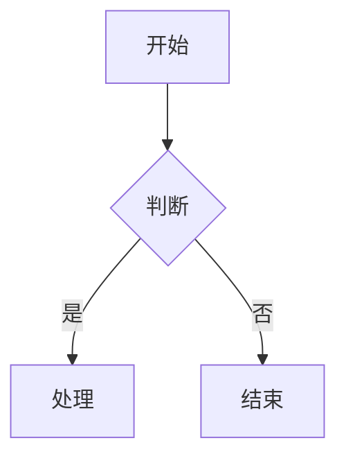
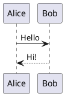

# feishu_mcp_create_doc

通过 MCP 调用 `create-doc`，从 Lark-flavored Markdown 内容创建一个新的飞书云文档。

# 返回值

工具成功执行后，返回一个 JSON 对象，包含以下字段：

- **`doc_id`**（string）：文档的唯一标识符（token），格式如 `doxcnXXXXXXXXXXXXXXXXXXX`
- **`doc_url`**（string）：文档的访问链接，可直接在浏览器中打开，格式如 `https://www.feishu.cn/docx/doxcnXXXXXXXXXXXXXXXXXXX`
- **`message`**（string）：操作结果消息，如"文档创建成功"


# 参数

## markdown（必填）
文档的 Markdown 内容，使用 Lark-flavored Markdown 格式。

调用本工具的markdown内容应当尽量结构清晰,样式丰富, 有很高的可读性. 合理的使用callout高亮块, 分栏,表格等能力,并合理的运用插入图片与mermaid的能力,做到图文并茂..
你需要遵循以下原则:

- **结构清晰**：标题层级 ≤ 4 层，用 Callout 突出关键信息
- **视觉节奏**：用分割线、分栏、表格打破大段纯文字
- **图文交融**：流程和架构优先用 Mermaid/PlantUML 可视化
- **克制留白**：Callout 不过度、加粗只强调核心词

当用户有明确的样式,风格需求时,应当以用户的需求为准!!

**重要提示**：
- **禁止重复标题**：markdown 内容开头不要写与 title 相同的一级标题！title 参数已经是文档标题，markdown 应直接从正文内容开始
- **目录**：飞书自动生成，无需手动添加
- Markdown 语法必须符合 Lark-flavored Markdown 规范，详见下方"内容格式"章节
- 创建较长的文档时,强烈建议配合update-doc中的append mode, 进行分段的创建,提高成功率.

## title（可选）
文档标题。

## folder_token（可选）
父文件夹的 token。如果不提供，文档将创建在用户的个人空间根目录。

folder_token 可以从飞书文件夹 URL 中获取，格式如：`https://xxx.feishu.cn/drive/folder/fldcnXXXX`，其中 `fldcnXXXX` 即为 folder_token。

## wiki_node（可选）
知识库节点 token 或 URL（可选，传入则在该节点下创建文档，与 folder_token 和 wiki_space 互斥）

wiki_node 可以从飞书知识库页面 URL 中获取，格式如：`https://xxx.feishu.cn/wiki/wikcnXXXX`，其中 `wikcnXXXX` 即为 wiki_node token。

## wiki_space（可选）
知识空间 ID（可选，传入则在该空间根目录下创建文档。特殊值 `my_library` 表示用户的个人知识库。与 wiki_node 和 folder_token 互斥）

wiki_space 可以从知识空间设置页面 URL 中获取，格式如：`https://xxx.feishu.cn/wiki/settings/7448000000000009300`，其中 `7448000000000009300` 即为 wiki_space ID。

**参数优先级**：wiki_node > wiki_space > folder_token

# 示例

## 示例 1：创建简单文档

```json
{
  "title": "项目计划",
  "markdown": "# 项目概述\n\n这是一个新项目。\n\n## 目标\n\n- 目标 1\n- 目标 2"
}
```

## 示例 2：创建到指定文件夹

```json
{
  "title": "会议纪要",
  "folder_token": "fldcnXXXXXXXXXXXXXXXXXXXXXX",
  "markdown": "# 周会 2025-01-15\n\n## 讨论议题\n\n1. 项目进度\n2. 下周计划"
}
```

## 示例 3：使用飞书扩展语法

使用高亮块、表格等飞书特有功能：

```json
{
  "title": "产品需求",
  "markdown": "<callout emoji=\"💡\" background-color=\"light-blue\">\n重要需求说明\n</callout>\n\n## 功能列表\n\n<lark-table header-row=\"true\">\n| 功能 | 优先级 |\n|------|--------|\n| 登录 | P0 |\n| 导出 | P1 |\n</lark-table>"
}
```

## 示例 4：创建到知识库节点下

```json
{
  "title": "技术文档",
  "wiki_node": "wikcnXXXXXXXXXXXXXXXXXXXXXX",
  "markdown": "# API 接口说明\n\n这是一个知识库文档。"
}
```

## 示例 5：创建到知识空间根目录

```json
{
  "title": "项目概览",
  "wiki_space": "7448000000000009300",
  "markdown": "# 项目概览\n\n这是知识空间根目录下的一级文档。"
}
```

## 示例 6：创建到个人知识库

```json
{
  "title": "学习笔记",
  "wiki_space": "my_library",
  "markdown": "# 学习笔记\n\n这是创建在个人知识库中的文档。"
}
```

# 内容格式

文档内容使用 **Lark-flavored Markdown** 格式，这是标准 Markdown 的扩展版本，支持飞书文档的所有块类型和富文本格式。

## 通用规则

- 使用标准 Markdown 语法作为基础
- 使用自定义 XML 标签实现飞书特有功能（具体标签见各功能章节）
- 需要显示特殊字符时使用反斜杠转义：`* ~ ` $ [ ] < > { } | ^`

---

## 📝 基础块类型

### 文本（段落）

```markdown
普通文本段落

段落中的**粗体文字**

多个段落之间用空行分隔。

居中文本 {align="center"}
右对齐文本 {align="right"}
```

**段落对齐**：支持 `{align="left|center|right"}` 语法。可与颜色组合：`{color="blue" align="center"}`

### 标题

飞书支持 9 级标题。H1-H6 使用标准 Markdown 语法，H7-H9 使用 HTML 标签：

```markdown
# 一级标题
## 二级标题
### 三级标题
#### 四级标题
##### 五级标题
###### 六级标题
<h7>七级标题</h7>
<h8>八级标题</h8>
<h9>九级标题</h9>

# 带颜色的标题 {color="blue"}
## 红色标题 {color="red"}
# 居中标题 {align="center"}
## 蓝色居中标题 {color="blue" align="center"}
```

**标题属性**：支持 `{color="颜色名"}` 和 `{align="left|center|right"}` 语法，可组合使用。颜色值：red, orange, yellow, green, blue, purple, gray。请谨慎使用该能力.

### 列表
有序列表,无序列表嵌套使用tab或者 2 空格缩进
```markdown
- 无序项1（
  - 无序项1.a
  - 无序项1.b

1. 有序项1
2. 有序项2

- [ ] 待办
- [x] 已完成
```

### 引用块

```markdown
> 这是一段引用
> 可以跨多行

> 引用中支持**加粗**和*斜体*等格式
```

### 代码块

**⚠️** 只支持围栏代码块（` ``` `），不支持缩进代码块。

````markdown
```python
print("Hello")
```
````

支持语言：python, javascript, go, java, sql, json, yaml, shell 等。

### 分割线

```markdown
---
```

---

## 🎨 富文本格式

### 文本样式

`**粗体**` `*斜体*` `~~删除线~~` `` `行内代码` `` `<u>下划线</u>`

### 文字颜色

`<text color="red">红色</text>` `<text background-color="yellow">黄色背景</text>`

支持: red, orange, yellow, green, blue, purple, gray

### 链接

`[链接文字](https://example.com)` （不支持锚点链接）

### 行内公式（LaTeX）

`$E = mc^2$`（`$`前后需空格）或 `<equation>E = mc^2</equation>`（无限制，推荐）

---

## 🚀 高级块类型

### 高亮块（Callout）

```html
<callout emoji="✅" background-color="light-green" border-color="green">
支持**格式化**的内容，可包含多个块
</callout>
```

**属性**: emoji (使用emoji 字符如 ✅ ⚠️ 💡), background-color, border-color, text-color

**背景色**: light-red/red, light-blue/blue, light-green/green, light-yellow/yellow, light-orange/orange, light-purple/purple, pale-gray/light-gray/dark-gray

**常用**: 💡light-blue(提示) ⚠️light-yellow(警告) ❌light-red(危险) ✅light-green(成功)

**限制**: callout子块仅支持文本、标题、列表、待办、引用。不支持代码块、表格、图片。

### 分栏（Grid）

适合对比、并列展示场景。支持 2-5 列：
#### 两栏（等宽）

```html
<grid cols="2">
<column>

左栏内容

</column>
<column>

右栏内容

</column>
</grid>
```
#### 三栏自定义宽度
```html
<grid cols="3">
<column width="20">左栏(20%)</column>
<column width="60">中栏(60%)</column>
<column width="20">右栏(20%)</column>
</grid>
```

**属性**: `cols`(列数 2-5), `width`(列宽百分比，总和为100，等宽时可省略)

### 表格

#### 标准 Markdown 表格

```markdown
| 列 1 | 列 2 | 列 3 |
|------|------|------|
| 单元格 1 | 单元格 2 | 单元格 3 |
| 单元格 4 | 单元格 5 | 单元格 6 |
```

#### 飞书增强表格

当单元格需要复杂内容（列表、代码块、高亮块等）时使用。

**层级结构**（必须严格遵守）：
```
<lark-table>                    ← 表格容器
  <lark-tr>                     ← 行（直接子元素只能是 lark-tr）
    <lark-td>内容</lark-td>     ← 单元格（直接子元素只能是 lark-td）
    <lark-td>内容</lark-td>     ← 每行的 lark-td 数量必须相同！
  </lark-tr>
</lark-table>
```

**属性**：
- `column-widths`：列宽，逗号分隔像素值，总宽≈730
- `header-row`：首行是否为表头（`"true"` 或 `"false"`）
- `header-column`：首列是否为表头（`"true"` 或 `"false"`）

**单元格写法**：内容前后必须空行
```html
<lark-td>

这里写内容

</lark-td>
```

**完整示例**（2行3列）：
```html
<lark-table column-widths="200,250,280" header-row="true">
<lark-tr>
<lark-td>

**表头1**

</lark-td>
<lark-td>

**表头2**

</lark-td>
<lark-td>

**表头3**

</lark-td>
</lark-tr>
<lark-tr>
<lark-td>

普通文本

</lark-td>
<lark-td>

- 列表项1
- 列表项2

</lark-td>
<lark-td>

代码内容

</lark-td>
</lark-tr>
</lark-table>
```

**限制**：单元格内不支持 Grid 和嵌套表格

**合并单元格**：读取时返回 `rowspan/colspan` 属性，创建暂不支持

**禁止**：
- 混用 Markdown 表格语法（`|---|`）
- 使用 `<br/>` 换行
- 遗漏 `<lark-td>` 标签


### 图片

```html
<image url="https://example.com/image.png" width="800" height="600" align="center" caption="图片描述文字"/>
```

**属性**: url (必需，系统会自动下载并上传), width, height, align (left/center/right), caption

**⚠️ 重要**: 不支持直接使用 `token` 属性（如 `<image token="xxx"/>`），只支持 URL 方式。系统会自动下载图片并上传到飞书。

支持 PNG/JPG/GIF/WebP/BMP，最大 10MB

**图片/文件插入方式选择**：
- **有公开可访问的图片 URL** → 直接在 create-doc / update-doc 的 markdown 中使用 `<image url="..."/>` 一步到位

- **本地图片或文件**（如用户在聊天中发送的图片/文件） → 先用 create-doc / update-doc 创建或更新文档文本内容，再用 `feishu_doc_media` 工具将本地图片或文件追加到文档末尾。如需媒体出现在文档中间特定位置，可先用 create-doc 写好之前的内容，调用 `feishu_doc_media` 追加图片/文件，最后用 update-doc 的 **append** 模式追加后续内容

### 文件

```html
<file url="https://example.com/document.pdf" name="文档.pdf" view-type="1"/>
```

**属性**:
- url (文件 URL，必需，系统会自动下载并上传)
- name (文件名，必需)
- view-type (1=卡片视图, 2=预览视图，可选)

**⚠️ 重要**: 不支持直接使用 `token` 属性（如 `<file token="xxx"/>`）


### 画板（Mermaid / PlantUML 图表）

支持两种图表语法：Mermaid 和 PlantUML。

#### Mermaid 图表

**图表优先选择此格式**. mermaid图表会被渲染为可视化的画板, 如果能用mermaid实现的图表,应当优先选择mermaid.

````markdown

````

**支持图表类型**: flowchart, sequenceDiagram, classDiagram, stateDiagram, gantt, mindmap, erDiagram

#### PlantUML 图表

PlantUML图表会被渲染为可视化的画板. mermaid满足不了的场景可以选择plantUML进行绘图.

````markdown

````

**支持图表类型**: sequence, usecase, class, activity, component, state, object, deployment

#### 读取画板

读取时返回 `<whiteboard>` 标签：

```html
<whiteboard token="xxx" align="center" width="800" height="600"/>
```

**属性**: token (画板标识), align (left/center/right), width, height

**重要说明**：
- create-doc时用 Mermaid/PlantUML 代码块，系统自动转换为画板; 禁止以`<whiteboard>`的方式写入!!
- 读取时只能获取 token，可通过fetch-file工具进行查看内容。无法获取原始源码

### 多维表格（Bitable）

```html
<bitable view="table"/>
<bitable view="kanban"/>
```

**属性**: view (table/kanban，默认 table)

**注意**: token 是只读属性，创建时不能指定只能创建空的多维表格，创建后再手动添加数据。

### 会话卡片（ChatCard）

```html
<chat-card id="oc_xxx" align="center"/>
```

**属性**: id (格式 oc_xxx, 必需), align (left/center/right)

### 内嵌网页（Iframe）

```html
<iframe url="https://example.com/survey?id=123" type="12"/>
```

**属性**: url (必需), type (组件类型数字, 必需)

**type 枚举**: 1=Bilibili, 2=西瓜, 3=优酷, 4=Airtable, 5=百度地图, 6=高德地图, 8=Figma, 9=墨刀, 10=Canva, 11=CodePen, 12=飞书问卷, 13=金数据

**重要提示**: 仅支持上述列出的网页类型。其他类型的网页不支持嵌入，请不要使用 iframe。对于普通网页链接，请使用 Markdown 链接格式 `[链接文字](URL)` 代替。

### 链接预览（LinkPreview）

```html
<link-preview url="消息链接" type="message"/>
```

**属性**: url (必需, 只写属性), type (message=消息链接)

目前仅支持消息链接, 只支持读取, 不支持创建

### 引用容器（QuoteContainer）

```html
<quote-container>
引用容器内容
</quote-container>
```

与 quote 引用块不同，引用容器是容器类型，可包含多个子块

---

## 🔧 高级功能块

### 电子表格（Sheet）

```html
<sheet rows="5" cols="5"/>
<sheet/>
```

**属性**: rows (行数，默认 3，最大 9), cols (列数，默认 3)

**注意**: token 是只读属性，创建时不能指定。只能创建空的电子表格，创建后使用 Sheet API 操作数据。

### 只读块类型 🔒

以下块类型仅支持读取，不支持创建：

| 块类型 | 标签 | 说明 |
|--------|------|------|
| 思维笔记 | `<mindnote token="xxx"/>` | 仅获取占位信息 |
| 流程图/UML | `<diagram type="1"/>` | type: 1=流程图, 2=UML |
| AI 模板 | `<ai-template/>` | 无内容占位块 |

### 任务块

```html
<task task-id="xxx" members="ou_123, ou_456" due="2025-01-01">任务标题</task>
```

**属性**: task-id, members (成员ID列表), due (截止日期)

### 同步块

```html
<!-- 源同步块：内容在子块中 -->
<source-synced align="1">子块内容...</source-synced>

<!-- 引用同步块：自动获取源文档内容 -->
<reference-synced source-block-id="xxx" source-document-id="yyy">源内容...</reference-synced>
```

**属性**: source-synced 有 align；reference-synced 有 source-block-id, source-document-id

### 文档小组件（AddOns）

```html
<add-ons component-type-id="blk_xxx" record='{"key":"value"}'/>
```

**属性**: component-type-id (小组件类型ID), record (JSON数据)

包含多种类型：问答互动、日期提醒等。部分组件如 Mermaid 已专门封装为 board 块

### 旧版小组件（ISV）

```html
<isv id="comp_xxx" type="type_xxx"/>
```

**属性**: component_id, component_type_id

旧版开放平台小组件，新版请使用 AddOns

### Wiki 子目录（WikiCatalog）🕰️

```html
<wiki-catalog token="wiki_xxx"/>
```

**属性**: wiki_token (知识库节点token)

🕰️ 旧版，建议使用新版 sub-page-list

### Wiki 子页面列表（SubPageList）

```html
<sub-page-list wiki="wiki_xxx"/>
```

**属性**: wiki_token (当前页面的wiki token)

仅支持知识库文档创建，需传入当前页面的 wiki token

### 议程（Agenda）

```html
<agenda>
  <agenda-item>
    <agenda-title>议程标题</agenda-title>
    <agenda-content>议程内容</agenda-content>
  </agenda-item>
</agenda>
```

**结构**: agenda (容器) → agenda_item (议程项) → agenda_title (标题) + agenda_content (内容)

### Jira 问题（JiraIssue）

```html
<jira-issue id="xxx" key="PROJECT-123"/>
```

**属性**: id (Jira问题ID), key (Jira问题Key)

### OKR 系列⚠️

```html
<okr id="okr_xxx">
  <objective id="obj_1">
    <kr id="kr_1"/>
  </objective>
</okr>
```

⚠️ 仅支持 user_access_token 创建，需使用 OKR API 进行详细操作

**结构**: okr → okr_objective (目标) → okr_key_result (关键结果) + okr_progress (进展)

---

## 📎 提及和引用

### 提及用户

```html
<mention-user id="ou_xxx"/>
```

**属性**: id (用户 open_id，格式 ou_xxx)

注意不要直接在文档中写`@张三` 这类格式,应当使用search-user获取用户的id,并使用`mention-user`.

### 提及文档

```html
<mention-doc token="doxcnXXX" type="docx">文档标题</mention-doc>
```

**属性**: token (文档 token), type (docx/sheet/bitable)

---

## 📅 日期和时间

### 日期提醒（Reminder）

```html
<reminder date="2025-12-31T18:00+08:00" notify="true" user-id="ou_xxx"/>
```

**属性**:
- date (必需): `YYYY-MM-DDTHH:mm+HH:MM`, ISO 8601 带时区偏移
- notify (true/false): 是否发送通知
- user-id (必需): 创建者用户 ID

---

## 📐 数学表达式

### 块级公式（LaTeX）

````markdown
$$
\int_{0}^{\infty} e^{-x^2} dx = \frac{\sqrt{\pi}}{2}
$$
````

### 行内公式

```markdown
爱因斯坦方程：$E = mc^2$（注意 $ 前后需空格，紧邻位置不能有空格）
```

---

## ✍️ 写作指南

### 场景速查

| 场景 | 推荐组件 | 说明 |
|------|----------|------|
| 重点提示/警告 | Callout | 蓝色提示、黄色警告、红色危险 |
| 对比/并列展示 | Grid 分栏 | 2-3 列最佳，配合 Callout 更醒目 |
| 数据汇总 | 表格 | 简单用 Markdown，复杂嵌套用 lark-table |
| 步骤说明 | 有序列表 | 可嵌套子步骤 |
| 时间线/版本 | 有序列表 + 加粗日期 | 或用 Mermaid timeline |
| 代码展示 | 代码块 | 标注语言，适当添加注释 |
| 知识卡片 | Callout + emoji | 用于概念解释、小贴士 |
| 引用说明 | 引用块 > | 引用原文、名言 |
| 术语对照 | 两列表格 | 中英文、缩写全称等 |

---

## 🎯 最佳实践

- **空行分隔**：不同块类型之间用空行分隔
- **转义字符**：特殊字符用 `\` 转义：`\*` `\~` `\``
- **图片**：使用 URL，系统自动下载上传
- **分栏**：列宽总和必须为 100
- **表格选择**：简单数据用 Markdown，复杂嵌套用 `<lark-table>`
- **提及**：@用户用 `<mention-user>`，@文档用 `<mention-doc>`
- **目录**：飞书自动生成，无需手动添加

---

## 📖 补充说明

- 图片、画板、多维表格需要 token（URL 会自动上传转换）
- 提及用户和会话卡片需要相应访问权限
- 完全兼容标准 Markdown
